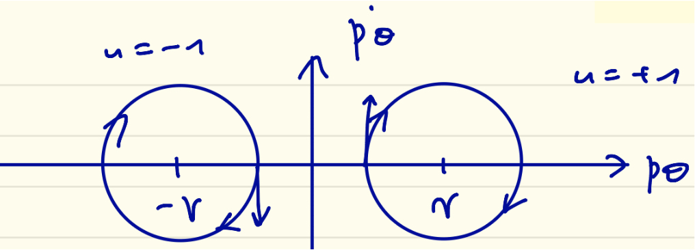

---
header-includes:
  - \usepackage{mathrsfs}
---


## MAM3

# Commande optimale
# 2024-25
# Exam CC no. 1

**Durée 2H00. Documents autorisés. Tous les exercices sont indépendants.
Le barème prévisionnel est indiqué pour chaque exercice.**


## Exercice 1 (7 points)

On considère le problème à temps final $t_f > 0$ fixé

$$ \int_0^{t_f} (x_2^2(t)+u_1^2(t)+u_2^2(t))\,\mathrm{d}t \to \min $$

pour la dynamique

$$ \dot{x}_1(t) =-x_2(t)+u_2(t),\quad
   \dot{x}_2(t) = x_1(t)-u_1(t),\quad t \in [0,t_f], $$ 
   
où $x(t)$ et $u(t)$ sont dans $\mathbf{R}^2$, où $x(0)=x_0$ est fixé, et où la condition terminale est

$$ x_1(t_f) + x_2(t_f) = 1. $$

### 1.1

Donner le hamiltonien du problème, en fonction de l'état $x$, du contrôle $u$, de l'adjoint $p$ et du scalaire $p^0$.

**Réponse.** $H(x,p,u) = p^0(x_2^2+u_1^2+u_2^2)+p_1(-x_2+u_2)+p_2(x_1-u_1)$

### 1.2

Supposer, par l'absurde que $p^0 = 0$, et montrer qu'alors $p$ doit être identiquement nul. Conclure.

**Réponse.** Si $p^0$ est nul, le Hamiltonien doit être maximisé *sans contrainte* sur $u$ ce qui implique $p_1 = p_2 = 0$ presque partout (donc partout, par absolue continuité) : impossible.

### 1.3

On pose $p^0 =-1/2$ pour la suite. Déterminer le système adjoint.

**Réponse.** $\dot{p}_1 =-p_2$, $\dot{p}_2 = x_2+p_1$ 

### 1.4
Écrire les conditions de transversalité.

**Réponse.** $p_1(t_f) - p_2(t_f) = 0$

### 1.5

Déterminer le contrôle en fonction de l'état et de l'état adjoint à l'aide de la condition de maximisation.

**Réponse.** $u(t) = (-p_2(t),p_1(t))$

### 1.6

Injecter ce contrôle dans le hamiltonien pour déterminer le hamiltonien maximisé (fonction de l'état et de l'état adjoint seulement) et compléter le code ci-dessous.

```julia
# Hamiltonian
function h(t, x, p)
    r = 0.5(p[1]^2 + p[2]^2 - x[2]^2) - p[1] * x[2] + p[2] * x[1] # **** TO BE UPDATED ****
    return r
end

f = Flow(Hamiltonian(h))

# Shooting function
function shoot(p0)
    xf, pf = f(t0, x0, p0, tf)
    s = [xf[1] + xf[2] - 1, pf[1] - pf[2]] # **** TO BE UPDATED ****
    return s
end
```

**Réponse.** Voir code ci-avant.

## Exercice 2 (10 points)

On considère le problème de navigation en temps minimal 

$$ \dot{x}(t)=w+\cos\theta(t),\quad
   \dot{y}(t)=\sin\theta(t),\quad
   \dot{\theta}(t)=u(t),\quad t \in [0,t_f], $$
   
où le vecteur position $(x(t),y(t))$ appartient à $\mathbf{R}^2$, l'argument de la
vitesse $\theta(t)$ à $\mathbf{R}$, et où $w \in \mathbf{R}$ est une constante fixée.
On ajoute la contrainte $|u(t)| \leq 1$ ainsi que des conditions aux limites

$$(x(0),y(0),\theta(0)) = (x_0,y_0,\theta_0),\quad
   (x(t_f),y(t_f),\theta(t_f)) = (x_f,y_f,\theta_f). $$
   
### 2.1

Montrer que si $|w| \geq 1$, le problème n'admet pas nécessairement
de solution.

**Réponse.** Prenons par exemple $w=1$, $x_0=0$ et $x_f=-1$ : comme $\dot{x}(t)$ est toujours positif, on ne pourra pas atteindre $x_f$ et l'ensemble des contraintes est vide.

### 2.2

On suppose désormais $w \in [0,1[$, et on note $p=(p_x,p_y,p_\theta)$ l'état adjoint. Écrire le hamiltonien du problème en fonction de l'état, du contrôle, de $p$ et de $p^0$.

**Réponse.** $H = p^0 + p_x(w + \cos\theta) + p_y\sin\theta + p_\theta u$

### 2.3

Écrire le système différentiel vérifié par l'état adjoint et montrer que $p_x$ et $p_y$ sont constants.

**Réponse.**

$$ \dot{p}_x(t) = 0,\quad \dot{p}_y(t) = 0,\quad \dot{p}_\theta(t) = p_x(t)\sin\theta(t) - p_y(t)\cos\theta(t), $$

d'o\`u la constance de $p_x$ et $p_y$.

### 2.4

Appliquer la condition de maximisation pour déterminer les contrôles optimaux.

**Réponse.** On a presque partout $u(t) = \text{sgn}(p_\theta(t))$ si $p_\theta(t) \neq 0$.

### 2.5

En déduire que, le long d'une extrémale optimale, on a

$$ 0 = p^0 + p_x w + p_x\cos\theta(t) + p_y\sin\theta(t) + |p_\theta(t)|,\quad t \in [0,t_f]. $$ 

**Réponse.** Comme on est en temps min, $H=0$ le long d'une extrémale et, par maximisation, $p_\theta(t)u(t) = |p_\theta(t)|$.

### 2.6

On suppose désormais $(p_x,p_y) \neq (0,0)$ et on pose $(p_x,p_y)=(\cos\psi,\sin\psi)$. Montrer que

$$ |p_\theta(t)|-\gamma =-\cos(\theta(t)-\psi,\quad \dot{p}_\theta(t) = \sin(\theta(t)-\psi), $$

où $\gamma$ est une constante que l'on précisera.

**Réponse.** Évident d'après ce qui précède avec $\gamma = -p^0 - p_x w$. 

### 2.7

En déduire que $(p_\theta(t),\dot{p}_\theta(t))$ appartient à un
ensemble que l'on dessinera pour $\gamma > 1$.

**Réponse.** Il s'agit de la réunion de deux cercles (éventuellement
tronqués selon la position des centres) de rayon $1$ et de centres $\pm \gamma$.
Quand $\gamma > 1$, les deux cercles sont disjoints, chacun dans un demi-plan.



### 2.8

Dans le cas $\gamma > 1$, montrer que le contrôle est constant, égal à $\pm 1$.

**Réponse.**  Les deux cercles étant disjoints, et $(p_\theta,\dot{p}_\theta)$
étant continues (au vu de l'équation différentielle vérifiée par
$p_\theta$), on est soit sur le cercle dans $p_\theta < 0$ (auquel cas $u = -1$), soit sur
le cercle dans $p_\theta > 0$ (auquel cas $u = 1$).

### 2.9

Dans le cas où le contrôle est constant égal à $+1$, donner
l'expression de $x(t)$, $y(t)$ et $\theta(t)$.

**Réponse.** $\theta(t) = \theta_0 + t$, $x(t) = x_0 + wt + \sin\theta(t) - \sin\theta_0$,
$y(t) = y_0 - \cos\theta(t) + \cos\theta_0$

## Exercice 3 (3 points)

On considère la portion de code suivant, extrait de l'application d'une méthode directe au problème de navigation :

```julia
# Objective
@objective(sys, Min, tau[1]+tau[2]+tau[3])

# Constraints 
@constraints(sys, begin
    x[1, 1] == x0
    y[1, 1] == y0
    th[1, 1] == th0
    x[2, 1] == x[1, P]
    y[2, 1] == y[1, P]
    th[2, 1] == th[1, P]
    x[3, 1] == x[2, P]
    y[3, 1] == y[2, P]
    th[3, 1] == th[2, P]
    x[3, P] == xf
    y[3, P] == yf
    th[3, P] == thf
    end)

# Dynamics: Crank-Nicolson scheme
for j in 1 : P-1
    @NLconstraints(sys, begin
    # x' = w + cos(theta)
    x[1, j+1] == x[1, j] + 0.5 * tau[1]*Dt * ( w + cos(th[1, j]) + w + cos(th[1, j+1]) )
    x[2, j+1] == x[2, j] + 0.5 * tau[2]*Dt * ( w + cos(th[2, j]) + w + cos(th[2, j+1]) )
    x[3, j+1] == x[3, j] + 0.5 * tau[3]*Dt * ( w + cos(th[3, j]) + w + cos(th[3, j+1]) )
    # y' = sin(theta) 
    y[1, j+1] == y[1, j] + 0.5 * tau[1]*Dt * ( sin(th[1, j]) + sin(th[1, j+1]) )
    y[2, j+1] == y[2, j] + 0.5 * tau[2]*Dt * ( sin(th[2, j]) + sin(th[2, j+1]) )
    y[3, j+1] == y[3, j] + 0.5 * tau[3]*Dt * ( sin(th[3, j]) + sin(th[3, j+1]) )
    # theta' = u
    th[1, j+1] == th[1, j] + tau[1]*Dt * u[1]
    th[2, j+1] == th[2, j] + tau[2]*Dt * u[2]
    th[3, j+1] == th[3, j] + tau[3]*Dt * u[3]
    end)
end
```

### 3.1

Indiquer la portion de code traduisant les conditions de jonction entre le premier et le deuxième arc.

**Réponse.**
```julia
    x[2, 1] == x[1, P]
    y[2, 1] == y[1, P]
    th[2, 1] == th[1, P]
```

### 3.2

Comment modifier ce code si le courant est dirigé non pas selon $(Ox)$ mais selon $(Oy)$ ? 

**Réponse.** Supprimer `w` dans les trois lignes `x[i, j+1] == ...` pour le mettre dans les trois lignes `y[i, j+1] == ...` pour `i = 1, 2, 3`.

### 3.3

Comment modifier ce code si on passe d'une solution comptant $3$ arcs à une solution à $2$ arcs ? 

**Réponse.** Les matrices d'inconnues associées aux états `x`, `y`, `z` n'auront plus que deux lignes, on supprime les équations discrétisant la dynamqique associées aux troisièmes lignes ainsi que la condition de jonction intermédiaire, `u` et `tau` ne sont plus que de dimension deux. 