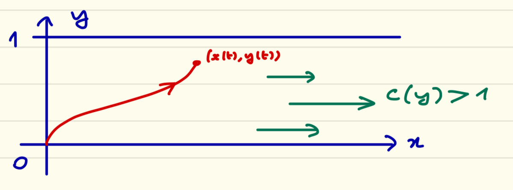

## MAM5-INUM - Commande optimale
# Exam CC no. 2

**Durée 2H00. Documents autorisés. Tous les exercices sont indépendants. Le barème prévisionnel est indiqué pour chaque exercice.**

## Exercice 1 (15 points)

On considère une barque se déplaçant à vitesse constante dans un canal rectiligne, de largeur constante. On peut supposer que la norme de la vitesse vaut un, et normaliser de même la largeur du canal à un. Il y a dans ce canal un courant $c(y)$ dirigé selon $(Ox)$ que l'on suppose *fort* (avec $c$ une fonction $\mathscr{C}^\infty$), c'est à dire tel que $c(y) > 1$, quel que soit $y$. On contrôle directement le cap du bateau, noté $u(t)$, de sorte que le système s'écrit

$$ \dot{x}(t) = \cos u(t) + c(y(t)),\quad \dot{y}(t) = \sin u(t), $$

avec $(x,y) \in \mathbf{R}^2$ les coordonnées dans le canal (voir figure ci-après) et $u \in \mathbf{R}$. Dans tout l'exercice on prend une condition initiale à l'origine, $(x(0),y(0)) = (0,0)$, le temps final $t_f$ est supposé *libre*, et on admettra que tous les problèmes considérés possèdent une solution.



**Partie A.** On s'intéresse pour commencer à minimiser le déport $x(t_f)$ quand on vise la berge opposée, $y(t_f) = 1$.

### 1.1

Mettre le problème sous forme de Lagrange avec un intégrande $f^0$ que l'on précisera.

**Réponse.** $f^0(x, y, u) = \cos u + c(y)$

### 1.2

Écrire le Hamiltonien du problème.

**Réponse.** $H(x, y, p_x, p_y, u) = (p^0 + p_x)(\cos u + c(y)) + p_y \sin u$

### 1.3

Écrire le système adjoint.

**Réponse.** $\dot{p}_x = 0$, $\dot{p}_y = -(p^0 + p_x)c'(y)$

### 1.4

Écrire les conditions de transversalité.

**Réponse.** Comme $x(t_f)$ est libre, on a $p_x(t_f) = 0$.

### 1.5

Montrer qu'on est nécessairement dans le cas normal. (On posera donc $p^0 = -1$.)

**Réponse.** On a $p_x = \text{cte} = 0$ d'après ce qui précède. Si $p^0 = 0$, on a $H = p_y \sin u$, donc $H = |p_y|$ par maximisation, avec $p_y$ constant (et nécessairement non nul) : contredit $H = 0$ (*cf.* $t_f$ libre).

### 1.6

Appliquer la condition de maximisation.

**Réponse.** On a $H = -\cos u + p_y \sin u -c(y) = \sqrt{1 + p_y^2}\cos(u - \alpha) - c(y)$, où $\alpha := \arg(-1 + i p_y)$.  Le hamiltonien est donc maximisé pour $u(t) = \arg(-1 + i p_y(t)) \ (2\pi)$, quand le $\cos$ vaut $1$.

### 1.7

En utilisant le fait que temps final est libre, montrer que

$$ \cos u(t) = -1/c(y(t)). $$

Que dire du signe de $\sin u(t)$ ?

**Réponse.** Comme $0 = H = \sqrt{1 + p_y^2} - c(y)$, on a $\cos u(t) = -1/\sqrt{1 + p_y^2} = -1/c(y(t))$. On a aussi $\sin^2 u = (c^2(y) - 1)/c^2(y)$ et, comme $\dot{x} = (c - 1)/c > 0$, la cible et l'invariance par translation selon $(Ox)$ du problème indiquent qu'on doit avoir $\dot{y} = \sin u > 0$, soit donc $\sin u = \sqrt{c^2 - 1}/c$.

### 1.8

Donner l'expression du temps final sous la forme d'une intégrale (dépendant de la fonction $c$).

**Réponse.**  On en déduit 

$$ t_f = \int_{y = 0}^{y = 1} \frac{c(y)\,\mathrm{d}y}{\sqrt{c^2(y) - 1}} \cdot $$

**Partie B.** On s'intéresse désormais au problème du temps minimal pour atteindre l'autre berge (conditions finales inchangées : $x(t_f)$ libre et $y(t_f) = 1$).

### 1.9

Écrire le Hamiltonien du problème.

**Réponse.** $H = p^0 + p_x(\cos u + c(y)) + p_y \sin u$

### 1.10

Montrer qu'on est nécessairement dans le cas normal. (On posera donc $p^0 = -1$.)

**Réponse.** On a toujours $p_x = \text{cte} = 0$ et, si $p^0 = 0$, $H = |p_y|$ par maximisation, avec $p_y$ non nul : contredit à nouveau $H = 0$ ($t_f$ libre).

### 1.11

Montrer que $p_y$ ne s'annule pas.

**Réponse.** Le système adjoint est linéaire en $p = (p_x, p_y)$, donc si $p_y$ s'annulait en un point, $p$ serait identiquement nul, et on aurait aussi $p^0 = 0$  puisque $H = 0$ : impossible. Donc $p_y$ est constant $(\dot{p}_y = 0)$ et non nul.

### 1.12

Appliquer la condition de maximisation et en déduire le contrôle optimal.

**Réponse.** On a $u = \text{sgn}(p_y)\pi/2$ ; comme $p_y$ est de signe constant et $u \equiv -\pi/2$ ne permet pas d'atteindre la cible, on a nécessairement $u \equiv \pi/2$.

### 1.13

Déterminer le temps minimal.

**Réponse.** D'après ce qui précède, $\dot{y} = 1$, donc $t_f = 1$.

**Partie C.** On s'intéresse finalement au problème du temps minimal pour atteindre un point fixé sur l'autre berge : $x(t_f) = x_f > 0$ et $y(t_f) = 1$.

### 1.14

Dans le cas normal, donner l'expression de $u$ en fonction des adjoints.

**Réponse.** Par maximisation du même $H$ qu'au B (cette fois avec $p_x$ constant mais non nécessairement nul), on a $u = \text{arg}(p)$. Si $p^0 = -1$ (cas normal), $0 = H = -1 + |p| + p_x c(y)$, d'où $\cos u = p_x / |p| = p_x / (1 - p_x c(y))$.

### 1.15

Dans le cas anormal, donner l'expression de $u$ : comment interpréter cette solution ?

**Réponse.** Avec $0 = H = |p| + p_x c(y)$, on est ramené au cas
$\cos u = p_x / |p| = -1 / c(y)$ , comme au A.

## Exercice 2 (5 points)

### 2.1

On considère un problème de commande optimale à temps final fixé dont les conditions terminales sont (état de dimension $2$)

$$ x_1(t_f) x_2(t_f) = 1. $$

Donner la condition de transversalité correspondante.

**Réponse.** L'application $h(x) = x_1 x_2 - 1$ est une submersion sur $\lbrace h = 0 \rbrace$ puisque $h'(x) = [x_2\ x_1]$ est non nul sur cet ensemble, et la condition est $p(t_f)$ colinéaire à $\nabla h(x(t_f))$, soit $p_1(t_f) x_1(t_f) - p_2(t_f) x_2(t_f) = 0$.

### 2.2

En déduire comment compléter le code de tir ci-dessous :

```julia
function shoot(p0)
    xf, pf = f(t0, x0, p0, tf)
    s = [xf[1] * xf[2] - 1, pf[1] * xf[1] - pf[2] * xf[2]] # À COMPLÉTER
    return s
end
```

**Réponse.** Voir code ci-avant.

### 2.3

Dans le code MPC ci-dessous, à quoi correspond le vecteur `ts` ?

```julia
while true
    
    w = drift(x1, y1)
    us, τs = solve(x1, y1, θ1, xf, yf, θf, w, P, print_level=0)
    ts = [ t1+τs[1], t1+τs[1]+τs[2] ]
    tf = t1+τs[1]+τs[2]+τs[3]
    if (t1+Δt < tf)
        t2 = t1+Δt
    else
        t2 = tf
        println("t2=tf: ", t2)
    end
    sol = trajectory((t1, t2), x1, y1, θ1, us, ts, drift)
    ...
end
```

**Réponse.** Le vecteur `ts` correspond aux deux instants de commutation.

### 2.4

On considère une partie d'Hexapawn pendant laquelle la machine vient de jouer le coup ci-dessous :

```matlab
[ 2 2 0        [ 2 0 0 
  1 0 1    ->    2 0 1
  0 0 1 ]        0 0 1 ]
```

La liste de coups de la machine associée à l'état précédent (= avant son dernier coup) était

```matlab
{ [ 1 2   , [ 1 2   , [ 1 2
    2 1 ]     2 2 ]     2 3 ] }
```

Comment cette liste doit-elle être mise à jour par renforcement ?

**Réponse.** Le coup joué par la machine est perdant et doit être supprimé, de sorte qu'après renforcement la liste devient

```matlab
{ [ 1 2   , [ 1 2
    2 2 ]     2 3 ] }
```
