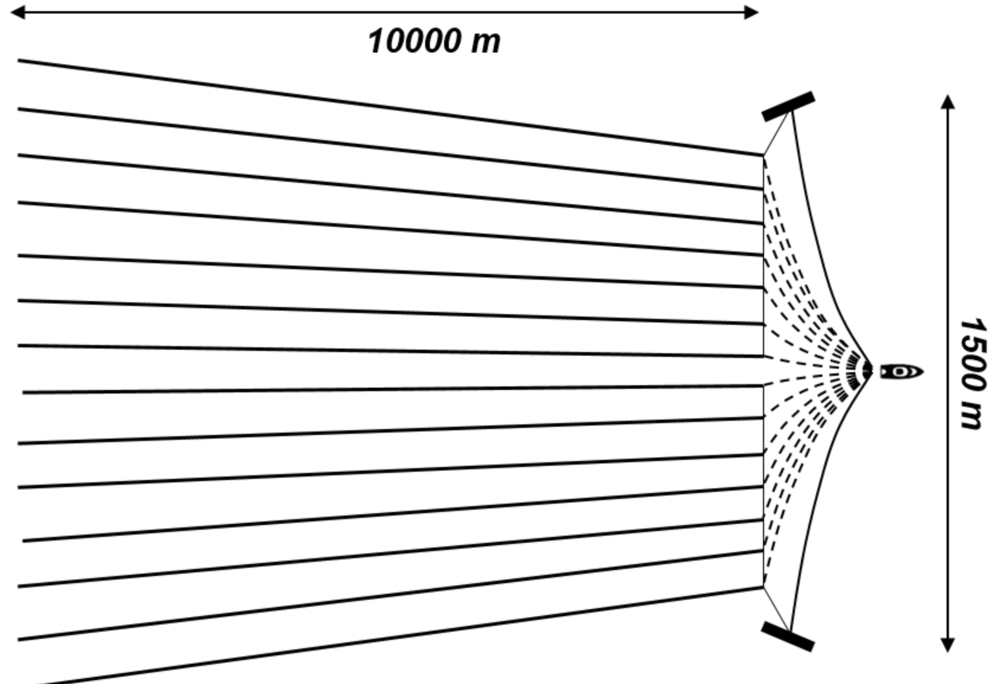

## MAM5-INUM - Commande optimale
# TP 1 - Navigation problem (a.k.a. Zermelo-Markov-Dubins)
### Special thanks: P. Negre & M. Sadak (Polytech Nice Sophia)

One considers a ship in a constant current, $0 \leq w \lt 1$. The angle of the velocity (wrt. to the water) is controlled, leading to the following dynamics:

$$ \begin{array}{rcl}
     \dot{x}(t) &=& w+\cos\theta(t),\quad t \in [0,t_f]\\
     \dot{y}(t) &=& \sin\theta(t),\\
     \dot{\theta}(t) &=& u(t). 
   \end{array} $$

The turning rate (= curvature of turns) is limited, so $|u(t)| \leq 1$. There boundary conditions at $t=0$ and $t=t_f$ on the position $(x,y)$ and on the angle $\theta$ of the velocity in the water referential. The final time is to be minimised. The problem originates from a collaboration with the French company [CGG](https://www.cgg.com) that is interested in optimal maneuvers for very large ships doing marine prospection.



```julia
using OptimalControl
using NLPModelsIpopt
using Plots

# Parameters
w = 0.8
x0 = 0 
y0 = 0 
θ0 = π/7
xf = 4
yf = 7
θf =-π/2 
N = 100

ocp = @def begin
    tf ∈ R, variable
    t ∈ [0, tf], time
    X = (x, y, θ) ∈ R³, state
    u ∈ R, control

    X(0)  == [x0, y0, θ0]
    X(tf) == [xf, yf, θf]

    ∂(x)(t) == w + cos(θ(t))
    ∂(y)(t) == sin(θ(t))
    ∂(θ)(t) == u(t)
```

```julia
# Solves for the control and state
println("Solving...")
N = 100
sol = solve(ocp; grid_size=N) 
plot(sol)
```