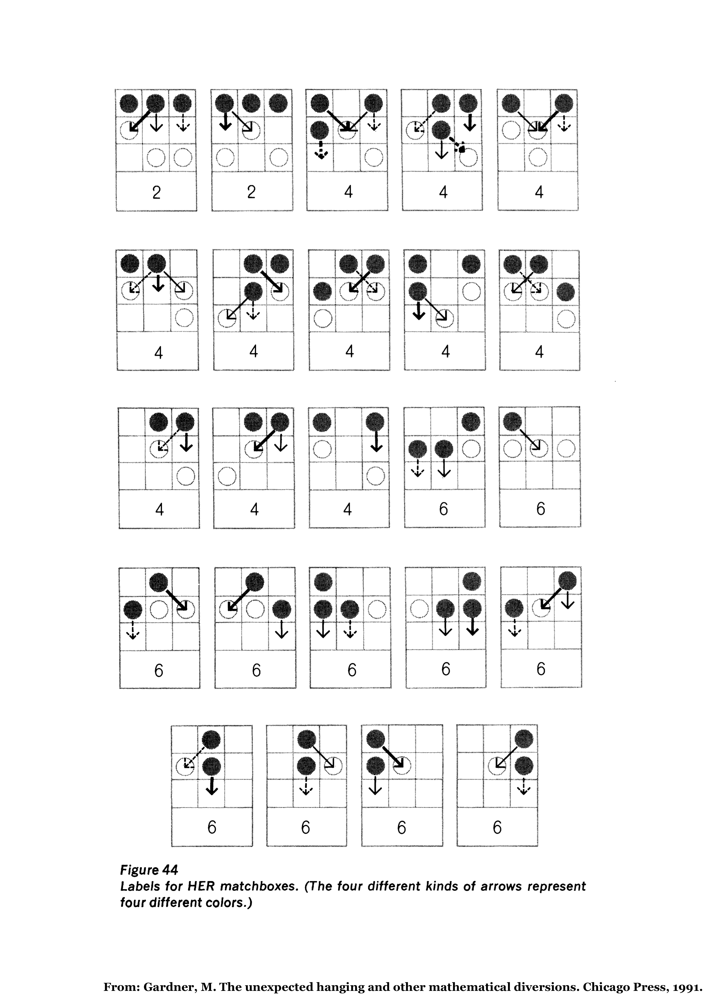

# TP 3 - Hexapawn


## MAM5-INUM - Commande

## Hexapawn

See: Gardner, M. *The unexpected hanging and other mathematical diversions.* Chicago Press, 1991.

[Hexapawn wiki](https://en.wikipedia.org/wiki/Hexapawn)




## Reinforcement

```julia
"""
    member(x, l)

Membership test

# Arguments
- `x`: numerical value
- `l`: list (array)

# Returns
- `b`: boolean

# Description
True if x belongs to l.
"""
function member(x, l)
    b = false
    n = length(l)
    i = 1
    
    while !b && (i <= n)
        if norm(l[i] - x) == 0
            b = true
        else
            i += 1
        end
    end
    
    return b
end
```

```julia
"""
    prune(x, l)

Prunes value

# Arguments
- `x`: numerical value
- `l`: list (array)

# Returns
- `ll`: list (array)

# Description
Prunes all occurences of x (if present) from list l
"""
function prune(x, l)
    ll = []
    
    for i = 1:length(l)
        if norm(l[i] - x) > 0
            push!(ll, l[i])
        end
    end
    
    return ll
end
```

```julia
"""
    reinforce(X, u, lX, lu)

Control reinforcement

# Arguments
- `X`: 3 x 3 matrix, state
- `u`: 2 x 2 matrix, control
- `lX`: list of states
- `lu`: list of list of controls (one list per possible state in lX)

# Returns
- `llu`: list of list of controls (updated)

# Description
Finds the list corresponding to state X in lu, and prunes u from it.
Error if X is not found in lX, or if u is not found in the list.
"""
function reinforce(X, u, lX, lu)
    n = length(lX)
    
    i = 1
    found = false
    
    while !found && (i <= n)
        if norm(lX[i] - X) == 0
            found = true
        else
            i += 1
        end
    end
    
    if !found
        error("State not found.")
    end
    
    llu = copy(lu)
    llu[i] = prune(u, llu[i])
    
    if length(llu[i]) == length(lu[i])
        error("Control to be pruned not found.")
    end
    
    return llu
end
```

## Dynamics of player1 (white) and player2 (black / AI)

```julia
"""
    f1(X, u)

Dynamics of player1

# Arguments
- `X`: 3 x 3 matrix, state
- `u`: 2 x 2 matrix, control

# Returns
- `Y`: 3 x 3 matrix, new state

# Description
Transition from state X when player1 applies control u
"""
function f1(X, u)
    if X[u[1, 1], u[1, 2]] != 1
        error("Wrong move.")
    end
    
    Y = copy(X)
    Y[u[1, 1], u[1, 2]] = 0
    Y[u[2, 1], u[2, 2]] = 1
    
    return Y
end
```

```julia
"""
    f2(X, u)

Dynamics of player2

# Arguments
- `X`: 3 x 3 matrix, state
- `u`: 2 x 2 matrix, control

# Returns
- `Y`: 3 x 3 matrix, new state

# Description
Transition from state X when player2 applies control u
"""
function f2(X, u)
    if X[u[1, 1], u[1, 2]] != 2
        error("Wrong move.")
    end
    
    Y = copy(X)
    Y[u[1, 1], u[1, 2]] = 0
    Y[u[2, 1], u[2, 2]] = 2
    
    return Y
end
```

## Random player1 and player2

```julia
"""
    play1(X, inter=false)

Random control generation for player1

# Arguments
- `X`: 3 x 3 matrix, state
- `inter`: boolean, interactive player1 [false]

# Returns
- `u`: control

# Description
Generates an admissible random move for player1 from state X. Error if no move is
allowed.
"""
function play1(X, inter=false)
    lu = gen1(X)
    n = length(lu)
    
    if n == 0
        error("No possible move.")
    end
    
    if inter
        println("Player 1 possible moves:")
        for i = 1:n
            println(f1(X, lu[i]))
        end
        while true
            print("Move ? ")
            i = parse(Int, readline())
            if (i >= 1) && (i <= n)
                break
            end
        end
        u = lu[i]
    else
        u = lu[rand(1:n)]
    end
    
    return u
end
```

```julia
"""
    play2(X, lX, lu)

Random control generation for player2

# Arguments
- `X`: 3 x 3 matrix, state
- `lX`: list of states
- `lu`: list of list of controls (one list per possible state in lX)

# Returns
- `u`: control

# Description
Picks in lu an admissible random move for player2 from state X. Empty [] control
if no move is allowed.
"""
function play2(X, lX, lu)
    n = length(lX)
    
    i = 1
    found = false
    
    while !found && (i <= n)
        if norm(lX[i] - X) == 0
            found = true
            l = lu[i]
        else
            i += 1
        end
    end
    
    if found
        m = length(l)
        if m == 0
            u = nothing
        else
            u = l[rand(1:m)]
        end
    else
        u = nothing
    end
    
    return u
end
```

## Win test for player1 and 2

```julia
"""
    win1(X)

Win test for player1

# Arguments
- `X`: 3 x 3 matrix, state

# Returns
- `b`: boolean, true if player1 wins

# Description
Player1 wins if (i) she reaches i=1, (ii) or she has taken all of player2 pawns,
(iii) or player2 cannot play any move.
"""
function win1(X)
    if !isempty(findall(X[1, :] .== 1))  # case (i)
        b = true
    elseif isempty(findall(X .== 2))  # case (ii)
        b = true
    elseif isempty(gen2(X))  # case (iii)
        b = true
    else
        b = false
    end
    
    return b
end
```

```julia
"""
    win2(X)

Win test for player2

# Arguments
- `X`: 3 x 3 matrix, state

# Returns
- `b`: boolean, true if player2 wins

# Description
Player2 wins if (i) she reaches i=3, (ii) or she has taken all of player1 pawns,
(iii) or player1 cannot play any move.
"""
function win2(X)
    if !isempty(findall(X[3, :] .== 2))  # case (i)
        b = true
    elseif isempty(findall(X .== 1))  # case (ii)
        b = true
    elseif isempty(gen1(X))  # case (iii)
        b = true
    else
        b = false
    end
    
    return b
end
```

## Generation of admissible controls for player1 and player2

```julia
"""
    gen1(X)

Control generation for player1

# Arguments
- `X`: 3 x 3 matrix, state

# Returns
- `lu`: list of controls

# Description
Generates all possible moves for player1 from state X.
"""
function gen1(X)
    lu = []
    
    idx = findall(X .== 1)
    i = [idx[k][1] for k in 1:length(idx)]
    j = [idx[k][2] for k in 1:length(idx)]
    
    for k = 1:length(i)
        if i[k] >= 2  # move
            if X[i[k]-1, j[k]] == 0
                u = [i[k] j[k]; i[k]-1 j[k]]
                push!(lu, u)
            end
        end
        
        if (i[k] >= 2) && (j[k] >= 2)  # take (1/2)
            if X[i[k]-1, j[k]-1] == 2
                u = [i[k] j[k]; i[k]-1 j[k]-1]
                push!(lu, u)
            end
        end
        
        if (i[k] >= 2) && (j[k] <= 2)  # take (2/2)
            if X[i[k]-1, j[k]+1] == 2
                u = [i[k] j[k]; i[k]-1 j[k]+1]
                push!(lu, u)
            end
        end
    end
    
    return lu
end
```

```julia
"""
    gen2(X)

Control generation for player2

# Arguments
- `X`: 3 x 3 matrix, state

# Returns
- `lu`: list of controls

# Description
Generates all possible moves for player2 from state X.
"""
function gen2(X)
    lu = []
    
    idx = findall(X .== 2)
    i = [idx[k][1] for k in 1:length(idx)]
    j = [idx[k][2] for k in 1:length(idx)]
    
    for k = 1:length(i)
        if i[k] <= 2  # move
            if X[i[k]+1, j[k]] == 0
                u = [i[k] j[k]; i[k]+1 j[k]]
                push!(lu, u)
            end
        end
        
        if (i[k] <= 2) && (j[k] >= 2)  # take (1/2)
            if X[i[k]+1, j[k]-1] == 1
                u = [i[k] j[k]; i[k]+1 j[k]-1]
                push!(lu, u)
            end
        end
        
        if (i[k] <= 2) && (j[k] <= 2)  # take (2/2)
            if X[i[k]+1, j[k]+1] == 1
                u = [i[k] j[k]; i[k]+1 j[k]+1]
                push!(lu, u)
            end
        end
    end
    
    return lu
end
```

## Game

```julia
"""
    game(lu1, lu3, lu5, inter=false, dsp=false)

Hexapawn game

# Arguments
- `lu1`: list, possible controls for u1 depending on X1
- `lu3`: list, possible controls for u3 depending on X3
- `lu5`: list, possible controls for u5 depending on X5
- `inter`: boolean, interactive player1 [false]
- `dsp`: boolean, display states [false]

# Returns
- `llu1`: list, reinforcement of lu1
- `llu3`: list, reinforcement of lu3
- `llu5`: list, reinforcement of lu5
- `winner`: integer, 1 or 2

# Description
Plays one Hexapawn game and reinforces player2 controls.
"""
function game(lu1, lu3, lu5, inter=false, dsp=false)
    global lX1, lX3, lX5
    
    X0 = [2 2 2; 0 0 0; 1 1 1]
    if dsp
        println("Initial game:")
        println(X0)
    end
    
    # Move 0: player1
    while true
        u0 = play1(X0, inter)
        if norm(u0 - [3 3; 2 3]) > 0
            break
        else
            if inter
                println("No right opening!")
            end
        end
    end
    
    X1 = f1(X0, u0)  # no possible win after u0
    if dsp
        println("Player 1 move:")
        println(X1)
    end
    
    # Move 1: player2
    u1 = play2(X1, lX1, lu1)
    X2 = f2(X1, u1)  # no possible win after u1
    if dsp
        println("Player 2 move:")
        println(X2)
    end
    
    # Move 2: player1
    u2 = play1(X2, inter)
    X3 = f1(X2, u2)
    if dsp
        println("Player 1 move:")
        println(X3)
    end
    
    if win1(X3) || isnothing(play2(X3, lX3, lu3))
        winner = 1
        lu1 = reinforce(X1, u1, lX1, lu1)
    else
        # Move 3: player2
        u3 = play2(X3, lX3, lu3)
        X4 = f2(X3, u3)
        if dsp
            println("Player 2 move:")
            println(X4)
        end
        
        if win2(X4)
            winner = 2
        else
            # Move 4: player1
            u4 = play1(X4, inter)
            X5 = f1(X4, u4)
            if dsp
                println("Player 1 move:")
                println(X5)
            end
            
            if win1(X5) || isnothing(play2(X5, lX5, lu5))
                winner = 1
                lu3 = reinforce(X3, u3, lX3, lu3)
            else
                # Move 5: player2
                u5 = play2(X5, lX5, lu5)
                X6 = f2(X5, u5)
                if dsp
                    println("Player 2 move:")
                    println(X6)
                end
                
                if win2(X6)
                    winner = 2
                else
                    winner = 1  # useless to play last move
                    lu5 = reinforce(X5, u5, lX5, lu5)
                end
            end
        end
    end
    
    llu1 = lu1
    llu3 = lu3
    llu5 = lu5
    
    return llu1, llu3, llu5, winner
end
```

## Iterated game for learning

```julia
using LinearAlgebra
using Plots

# List of states for X1, X3 and X5

const lX1 = [
    [2 2 2; 1 0 0; 0 1 1],
    [2 2 2; 0 1 0; 1 0 1]
]

const lX3 = [
    [2 0 2; 2 1 0; 0 0 1],
    [0 2 2; 1 2 0; 0 0 1],
    [2 0 2; 1 1 0; 0 1 0],
    [2 2 0; 1 0 1; 0 0 1],
    [0 2 2; 0 2 1; 1 0 0],
    [0 2 2; 2 1 1; 1 0 0],
    [2 0 2; 2 0 1; 0 1 0],
    [2 2 0; 1 1 2; 0 0 1],
    [0 2 2; 0 1 0; 0 0 1],
    [0 2 2; 0 1 0; 1 0 0],
    [2 0 2; 1 0 0; 0 0 1]
]

llX3 = []
for i = 1:length(lX3)
    X = lX3[i]
    Y = [X[:, 3] X[:, 2] X[:, 1]]
    if norm(X - Y) != 0
        if !member(Y, lX3)
            push!(llX3, Y)
        end
    end
end
lX3 = [lX3; llX3]  # adds missing symmetric configurations

const lX5 = [
    [0 0 2; 2 2 1; 0 0 0],
    [2 0 0; 1 1 1; 0 0 0],
    [0 2 0; 2 1 1; 0 0 0],
    [0 2 0; 1 1 2; 0 0 0],
    [2 0 0; 2 2 1; 0 0 0],
    [0 0 2; 1 2 2; 0 0 0],
    [0 0 2; 2 1 0; 0 0 0],
    [0 2 0; 1 2 0; 0 0 0],
    [0 2 0; 0 2 1; 0 0 0],
    [2 0 0; 2 1 0; 0 0 0],
    [0 0 2; 0 1 2; 0 0 0]
]

llX5 = []
for i = 1:length(lX5)
    X = lX5[i]
    Y = [X[:, 3] X[:, 2] X[:, 1]]
    if norm(X - Y) != 0
        if !member(Y, lX5)
            push!(llX5, Y)
        end
    end
end
lX5 = [lX5; llX5]  # adds missing symmetric configurations

# Lists of all possible controls (moves) for player2 associated from X1, X3 and X5

lu1 = []
for i = 1:length(lX1)
    push!(lu1, gen2(lX1[i]))
end

lu3 = []
for i = 1:length(lX3)
    push!(lu3, gen2(lX3[i]))
end

lu5 = []
for i = 1:length(lX5)
    push!(lu5, gen2(lX5[i]))
end

# Plays N games and learns

N = 500  # number of games
winner = zeros(Int, N)
inter = false  # interactive player1
dsp = false  # displays states

for i = 1:N
    lu1, lu3, lu5, winner[i] = game(lu1, lu3, lu5, inter, dsp)
    if dsp
        println("Player $(winner[i]) wins")
    end
end

plot(winner, ylim=(0.5, 2.5), xlim=(1, N), legend=false)
```

```julia
plot(cumsum(winner), ylim=(0, 2*N), xlim=(1, N), legend=false)
```
